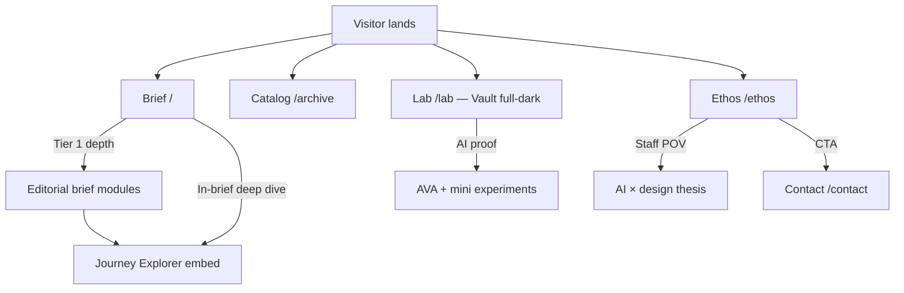

# Portfolio IA: Staff-level, AI-forward (lisa-portfolio)

## Problem Frame

Hiring managers for IC6+/staff product design need a fast, credible read on **level**, **systems judgment**, and **AI fluency** without the site sprouting unmanaged routes. The portfolio already locked **six top-level routes** and an **editorial brief** case format (`docs/DECISIONS.md`, `docs/SESSION_LOG.md` Session 7). Reference sites (Mahanay, Guglieri, Repponen, Mann) imply additional *surfaces*—mostly **sections and modules** on those routes, not a larger IA tree.

## Reader paths

## Requirements

**Frozen architecture**

- **R1.** Ship deep case work inside existing routes (`/`, `/archive`, `/lab`, `/ethos`, `/doodles`, `/contact`). Do **not** add `/work/[slug]` or other top-level sections unless Lisa explicitly changes the route decision in `docs/DECISIONS.md`.

**Index `/` — primary hiring narrative**

- **R2. Personal intro + positioning band**: The very top of Index opens with a **short personal intro** — conversational, first-person, grounding the reader immediately ("Hi, I'm Lisa — a product designer at Meta..."). This replaces a raw "cred ladder" with something warmer that still communicates: (1) **who you are and where** (current role/company), (2) **domains** — e.g. AI, monetization, 0→1, messaging — pick **2–4** that match target roles, (3) **1–2 outcome-forward hooks** that tee up the briefs below ("...where I led the redesign of a $3B+ ad surface" etc.). Detailed proof stays in each brief + **resume** (footer link). No client-logo strip (see R5).

- **R3. Editorial brief modules** (DECISIONS editorial brief format): Tier 1 slots for strongest **publicly available** IC6+ stories: **Flow 75 Chat Builder**, **Meta Inbox Ad Entry Points**, **Journey Explorer** — with **bet → numbers → constraint → move → work → unlock**, plus an **optional narrative layer** (expand, inline, or long scroll **within the same Index page**). **The interactive Journey Explorer demo lives inside the Journey Explorer case block on Index** (deep "work" / proof section), not on `/lab`. **BizAI** and other in-experiment projects are **not eligible** for Index until publicly launched; they live on the Selected Work page with confidentiality treatment (R6).

- **R4. Work chapters** (Mahanay / Repponen): **In-page chapters** (e.g., Meta vs Autodesk, or "Volume I / II") with clear interstitial labels — **confirmed direction** for organizing multiple major programs on `/`. Still on `/`, not separate URLs.

- **R5. Client / program strip — REJECTED for this portfolio.** Credibility comes from **R2 intro**, **briefs**, **Selected Work**, **Lab**, and **resume link in footer**.

**Catalog `/archive`**

- **R6. Catalog** (replaces "Archive"): **Renamed to "Catalog"** — curated, forward-facing, no archival connotation. This is a **forward-facing** index of **all projects** beyond the Tier 1 Brief page — Tier 2 work and additional shipped work. Uses table or index rows + **filter chips** for domains: **AI**, **Architecture**, **Monetization**, **Incubator**, **Messaging** (locked taxonomy — matches R2 domain language). **Confidential projects** that cannot be shown publicly are simply **omitted** from this page — they do not appear with any status indicator, experiment flag, or "coming soon" language, as even acknowledging their existence can be a confidentiality concern. They can be **added later** when publicly launched. Route path stays `/archive` (URL doesn't need to match display label).

**Lab `/lab`**

- **R7. Lab = experiments theatre (Vault — full dark):** `/lab` uses the darker **"Vault" / screen10** visual direction as a **full-page** dark experience — **including header and footer chrome**. This is not just a dark `<main>`; the entire viewport gets the Vault treatment. **Implementation:** `app/lab/layout.tsx` wraps the Lab route, overriding global header/footer colors (cream → dark ground, ethos blue accents retained). Azure Halo hidden or inverted on Lab. **Primary contents:** (1) **AVA** experiential. (2) **1–3 small "recruiter-impressive" experiments** — **ideas TBD**; brainstorm later. Reserve anchor stubs. **Journey Explorer is not hosted here.**

- **R8. Lab hub structure:** Single `/lab` page with **anchor zones** for AVA and each mini experiment (mini TOC optional). Sub-routes only if `docs/DECISIONS.md` route rule changes.

**Ethos `/ethos`**

- **R9. Staff POV + AI thesis + closing CTA**: Long-form manifesto voice (`docs/DESIGN.md`) plus an explicit **how you work with AI** section (quality bars, human judgment, risk) — Guglieri-level restraint, Repponen-level authored depth. **Ends with a CTA** bridging to Contact (e.g., "Want to talk about how I think about AI in product? → /contact") so the page is not a dead end in the hiring funnel.

**Doodles `/doodles`**

- **R10. Side-thread craft:** Doodles are **re-hosted in this repo** from **`https://lisaaufox.com/doodles`**, placed under **`public/doodles/`**.

**Contact `/contact`**

- **R11. Single contact destination**: Light Ethos for v1. **Vault aesthetic applies to Lab only.**

**Cross-cutting staff signals (sections/modules)**

- **R12. Metric-forward spine** (Mann): Each brief leads with **scannable numbers** before long prose.
- **R13. HMW / provocation blocks** (Mann): Optional where reframes matter — not on every brief.
- **R14. Micro-craft signature** (Guglieri): One or two **small, intentional details** that signal fit-and-finish.

**Site chrome**

- **R15. Resume in footer:** **`/resume.pdf`** (served from `public/resume.pdf`). Future: read.cv-style web resume.

**IC6+ narrative coverage**

- **R16. Staff-level gap narratives:** Across the **Index** briefs, at least **two** of these five themes must surface explicitly (in "the constraint," "the move," "what it unlocked," or inline narrative): (1) **Mentorship / team amplification**, (2) **Organizational influence** (changed how teams work), (3) **Design system governance**, (4) **Vision artifacts** (roadmaps, multi-quarter strategy), (5) **Judgment under ambiguity** (hard calls with incomplete info). This is a **content guidance** requirement, not a component — implementers / Lisa should ensure the copy hits these signals. The Meta briefs naturally cover several (cross-team org strategy, CFO stakeholders, GenAI paradigm shift); call them out explicitly rather than letting them be implicit.

**Mobile strategy for interactive content**

- **R17. JE mobile treatment:** On small viewports (below a breakpoint TBD during implementation, likely ~768px), Journey Explorer renders as a **static screenshot / hero image** with a **"Tap to interact with demo"** CTA that either (a) scrolls to the interactive version with a note to rotate to landscape, or (b) expands in-place. Broader mobile strategy for other interactive Lab elements (AVA, minis) needs a **dedicated discussion** at build time — noted as a **deferred design session**, not ignored.

## Success criteria

- A hiring manager can answer in **under one minute**: level, AI credibility, and **top three bets**.
- Strongest work is understandable **without** relying on new top-level case URLs.
- **AI positioning** appears in **Ethos + Lab (AVA + experiments) + at least one Tier 1 brief**.
- **Journey Explorer** is discoverable as **part of its case story on Index**, not as a Lab orphan.
- **Catalog** reads as **current and forward-looking**, not a graveyard.
- At least **two IC6+ gap themes** (R16) are explicitly present in case copy.

## Scope boundaries

- No password-gated case viewer in v1.
- No CMS/blog unless added later.
- No client-logo credibility row (R5 rejected).
- **BizAI** omitted from public site until publicly launched — no placeholder, no status badge.

## Key decisions

- **"New pages" = new major sections/modules** on the six routes, not a larger nav map.
- **AI-forward** = thesis (Ethos) + Lab (Vault + AVA + minis) + case framing (Index).
- **Contact v1:** Light Ethos.
- **Lab v1:** **Full-dark Vault** including header/footer chrome.
- **Work chapters (R4):** confirmed for Index organization.
- **Credibility:** Personal intro (R2) + Resume in footer + briefs + Catalog; **no** client strip.
- **Nav labels:** `[ 01 Brief ]` `[ 02 Catalog ]` `[ 03 Lab ]` `[ 04 Ethos ]` — every word is a deliberate design choice. "Brief" = editorial brief format on homepage. "Catalog" = curated collection, forward-facing.
- **Confidential projects:** **omit entirely** from public site — no "in experiment" flags, no "coming soon," no status indicators. Add when launched.
- **Doodles:** re-host from lisaaufox.com/doodles.
- **Resume:** placeholder PDF in `public/`; future read.cv-style web resume.
- **Lab minis:** no fixed list — brainstorm later; leave structural space.
- **Filter chip taxonomy (R6):** **AI**, **Architecture**, **Monetization**, **Incubator**, **Messaging** — **Research** removed from catalog chips.
- **Confidential posture:** omit entirely from public site; no flags, badges, or "coming soon."
- **JE mobile (R17):** static image + CTA on small viewports.
- **Ethos CTA (R9):** bridge to Contact at end of page.

## Dependencies / assumptions

- Tier 1 / Tier 2 project list and confidentiality posture stay as in `docs/DECISIONS.md` until updated.
- **Brief / Ethos / Contact / Catalog / Doodles** follow **Azure Ethos** cream/blue rules; **Lab** follows **Vault exception** (full dark, including chrome).

## Outstanding questions

### Resolve before planning

- None blocking.

### Deferred to planning / implementation

- ~~**[R6]** Final page name~~ — **resolved: "Catalog."**
- **[R7]** Brainstorm fun, quirky Lab minis with Lisa; then pick 1–3.
- **[R15b]** When to build read.cv-style web resume vs keeping PDF-only.
- **[R17]** Full mobile design session for all interactive elements.

## Next steps

- **Plan:** `docs/plans/2026-04-11-001-feat-staff-portfolio-surfaces-plan.md` — aligned with this doc; **do not execute** until you say go.
