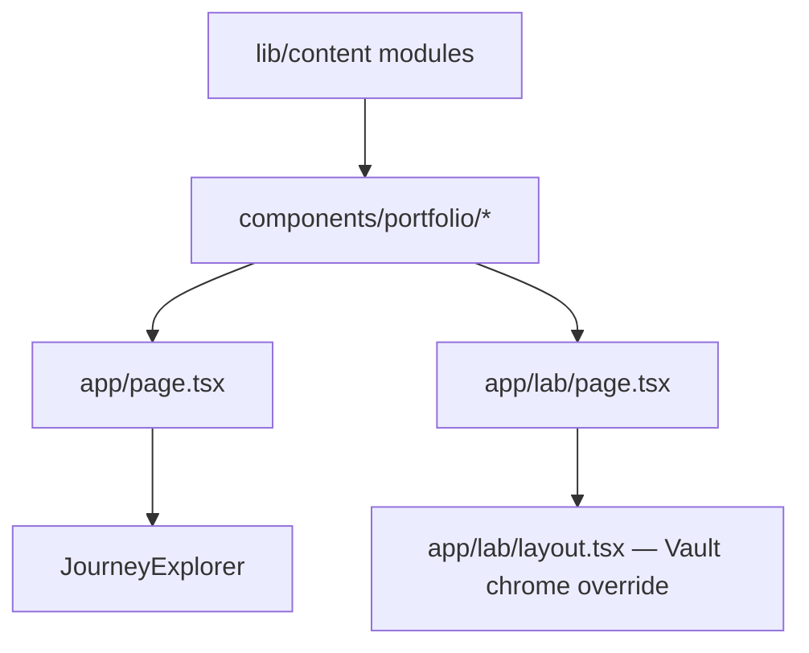

# feat: Staff-level / AI-forward portfolio surfaces (six routes)

## Overview

Implement the **major sections and modules** from the IA brainstorm on the **existing six App Router pages**, using **Azure Ethos** for cream pages + a **full-dark Vault** exception on Lab (including header/footer). **No new top-level case routes** (R1). **Journey Explorer** moves into the **JE editorial brief on Index** (static image + CTA on mobile). **Lab** = **AVA** + **1–3 mini experiments** in full-dark Vault. **Nav labels finalized:** `[ 01 Brief ]` `[ 02 Catalog ]` `[ 03 Lab ]` `[ 04 Ethos ]`. **Confidential projects omitted entirely** — no flags, badges, or "coming soon." **Contact** = Light Ethos. **Footer** has **Resume** (`/resume.pdf` — done). **No client strip.** **Doodles** re-hosted from lisaaufox.com.

## Problem Frame

Hiring managers need a fast read on **level**, **systems judgment**, and **AI fluency** (origin). The codebase currently hosts **Journey Explorer on Lab only**; product direction: **relocate JE into a Tier 1 case on Index**, **re-theme Lab** as full-dark Vault experiment theatre, and **rename Archive → "Catalog"** to house Tier 2 shipped projects. Confidential/unannounced projects are **omitted** until publicly launched.

## Requirements Trace

- **R1.** No `/work/[slug]`; depth stays on the six routes.
- **R2.** **Personal intro** at top of Index: first-person, conversational ("Hi, I'm Lisa…"), with current role, domains, and 1–2 outcome hooks (replaces cold cred ladder).
- **R3.** Editorial briefs on Index: **Flow 75**, **Inbox**, **JE** (publicly available Tier 1 only). **JE** embed lives inside its brief. Confidential projects (BizAI, FMUX) **omitted entirely** from public site until launched.
- **R4.** Work **chapters** on Index — confirmed.
- **R5.** ~~Client strip~~ **removed.**
- **R6.** **Catalog** (renamed from Archive): table + chips (**AI**, **Architecture**, **Monetization**, **Incubator**, **Messaging**). Confidential projects **omitted** — no status indicators, no experiment flags.
- **R7–R8.** Lab: **full-dark Vault** (including header/footer chrome), **AVA**, **1–3 minis** (TBD); anchor zones.
- **R9.** Ethos: manifesto + AI thesis + **closing CTA to Contact**.
- **R10.** Doodles: re-host in `public/doodles/`.
- **R11.** Contact: Light Ethos.
- **R12–R14.** Metrics-first briefs, optional HMW, micro-craft.
- **R15.** ~~Footer Resume~~ **Done** — `public/resume.pdf`, wired in `components/footer-nav.tsx`.
- **R16.** IC6+ gap coverage: ≥2 of 5 themes surface explicitly in brief copy.
- **R17.** JE on mobile: static image + "Tap to interact" CTA; broader mobile session deferred.
- **Success criteria** (origin): 60-second scan; AI on Ethos + Lab + ≥1 brief; JE via case on Index; Catalog reads forward-looking; ≥2 IC6+ gap themes in copy.

## Scope Boundaries

- No password-gated case viewer.
- No CMS/blog unless added later.
- **Full-dark Vault** = Lab only — all other pages cream Ethos.
- **BizAI / FMUX** omitted from the public site entirely until publicly launched — no placeholders, no status badges.

## Context & Research

### Relevant Code and Patterns

- **Layout:** `app/layout.tsx` applies cream `bg-ethos-cream`, Azure Halo, header, footer globally. **Lab** needs `app/lab/layout.tsx` to override chrome colors for full-dark Vault.
- **Journey Explorer:** `components/journey-explorer/` — imported from `app/lab/page.tsx` today; moves to Index. **JE was not designed for small viewports** — plan calls for static fallback on mobile (R17).
- **Footer:** `components/footer-nav.tsx` — **Resume already wired** (`/resume.pdf`).
- **Nav:** `components/main-nav.tsx` — labels updated: "Index" → **"Brief"**, "Archive" → **"Catalog"**. Already shipped. `href` stays `/archive`.
- **Stack:** Next.js 16.2.1, React 19, Tailwind 4.

### Planning-Time Resolutions

| Topic | Resolution |
|-------|------------|
| **R3 confidential cases** | Confidential/unannounced projects **omitted entirely** from public site. No data flags exposed to the visitor — content model uses `visibility: "public" | "omit"` internally; `"omit"` rows never render. Add projects when they launch. |
| **R6 "Archive" rename** | Display label → **"Catalog."** Route path stays `/archive`. Nav already updated in `main-nav.tsx`. |
| **R6 chip taxonomy** | **AI**, **Architecture**, **Monetization**, **Incubator**, **Messaging** — locked. **Research** chip removed. Content model enforces these as enum values. |
| **R7 Lab Vault scope** | **Full-dark experience** including header/footer chrome. `app/lab/layout.tsx` overrides global cream. Azure Halo hidden or inverted. Ethos blue accents retained. |
| **R8 Lab layout** | Single `/lab`, anchors: `#ava`, `#experiment-1`, … |
| **R10 Doodles** | Re-host in `public/doodles/`. |
| **R15 Resume** | **Done.** `public/resume.pdf` + footer link shipped. |
| **R7 Lab minis** | No preset list. Reserve up to three anchor zones; fill after brainstorm. |
| **R17 JE mobile** | Static screenshot + "Tap to interact" CTA below ~768px; exact breakpoint at implementation. |

**Deferred:** Contact form backend; AVA LLM/provider; exact Vault CSS tokens; full mobile design session for interactive elements.

## High-Level Technical Design

*Directional only — not implementation specification.*

- **Lab layout (`app/lab/layout.tsx`):** Overrides global header/footer with **dark Vault variants** — dark ground, cream/blue type, ethos-blue accents. Hides or dims Azure Halo. This is a **route-scoped layout** so the root `app/layout.tsx` still provides html/body/fonts, but Lab wraps its own chrome.
- **Index JE section:** Dynamic import + loading skeleton; on mobile (R17) renders static image with CTA overlay instead of mounting full Recharts client bundle.

## Lab mini-experiments — TBD (space reserved)

- **No committed candidate list.** Brainstorm later.
- **Implementation:** Ship Vault shell + AVA first; add "coming soon" `<section>` stubs.
- **Selection bar:** small surface area, ~60s readable, signals taste / systems / AI fluency.

**AVA** remains flagship Lab piece per `docs/DECISIONS.md`.

## System-Wide Impact

- **Remove JE from Lab** when Index embed ships.
- **Nav label change:** "Index" → "Brief" and "Archive" → "Catalog" in `components/main-nav.tsx` — **already shipped.**
- **Lab chrome override:** `app/lab/layout.tsx` replaces global header/footer styling on `/lab` only. **Careful:** global `:any-link:hover` rule in `globals.css` uses `#1313ec !important`; on dark ground this still works (blue on dark is fine), but the **base text/bg** of header and footer must flip.
- **Footer:** already has Resume link (5 items now). Test stacking at 575px breakpoint with the extra link.

## Risk Analysis & Mitigation

| Risk | Mitigation |
|------|------------|
| Index + JE bundle weight | Dynamic import + loading skeleton; lazy-load below-fold briefs and media. |
| JE on mobile | Static image + CTA; full interactive only on wider viewports (R17). |
| Lab Vault + accessibility | Enforce AA+ contrast on dark ground; test focus rings; verify nav readability. |
| Lab header/footer dark override complexity | Route-scoped layout (`app/lab/layout.tsx`) keeps root layout untouched; if too complex, scoped CSS class on `<html>` is fallback. |
| Doodles copyright / hotlinking | Host in `public/` after export. |
| Scope creep on minis | Cap at three; stub until brainstormed. |
| Catalog looking sparse | Include all Tier 2 shipped work from day one; as confidential projects launch, add them to keep the page growing. |

## Implementation Units

### Unit 0 — Docs & design guardrails

- [ ] **Goal:** Lock **Lab full-dark Vault** (including chrome), **nav labels (Brief / Catalog — already shipped in code)**, **confidential-projects-omitted policy**, **JE mobile treatment**, **IC6+ gap requirement (R16)**, and **Ethos CTA** in agent-facing rules.
- [ ] **Files:** `docs/DECISIONS.md` (updated this revision), `.cursor/rules/azure-ethos.mdc` (add Lab vault exception note + dark chrome rule).
- [ ] **Verification:** DECISIONS read by next agent.

### Unit 1 — Content model and portfolio types

- [ ] **Goal:** Typed **briefs**, **project index rows** (with `visibility: "public" | "omit"` — omitted rows never render; no experiment flags or status badges), **doodles**, **chapter** metadata. **Domain chip enum:** `"AI" | "Architecture" | "Monetization" | "Incubator" | "Messaging"`. **No `ClientStrip` type.**
- [ ] **Requirements:** R3, R4, R6, R10, R12, R16; enables R2, Brief (Index), Catalog, Doodles.
- [ ] **Files:** `lib/content/types.ts`, `lib/content/*.ts`, helpers `filterByDomain`, `getPublicRows`, etc.
- [ ] **Verification:** `npx tsc --noEmit`.

### Unit 2 — Shared editorial section components

- [ ] **Goal:** **Personal intro** (R2), editorial brief (six-part skeleton), chapter band, HMW block, metrics row; **omit** `client-strip.tsx` and old `cred-ladder.tsx` (replaced by personal intro).
- [ ] **Requirements:** R2, R4, R12–R14, R16.
- [ ] **Files:** `components/portfolio/personal-intro.tsx`, `editorial-brief.tsx`, `chapter-band.tsx`, `hmw-block.tsx`, barrel `index.ts`.
- [ ] **Approach:** Inside **editorial-brief**, support optional **`deepWorkSlot`** (React node) for JE. R16 is content guidance — flag in the brief component's props or docs that copy should hit IC6+ gap themes.
- [ ] **Verification:** `npm run build`; visual against `docs/DESIGN.md`.

### Unit 3 — Index page composition + Journey Explorer embed

- [ ] **Goal:** R2, R3, R4, R16, R17 — **personal intro** → **chapter bands** → **briefs** (Flow 75, Inbox, JE); **embed JE** inside JE brief's work section.
- [ ] **Requirements:** R3 (JE placement), R4, R12–R14, R16 (IC6+ gap copy), R17 (mobile).
- [ ] **Files:** `app/page.tsx`, content modules, `components/portfolio/journey-brief-section.tsx` (or similar).
- [ ] **Dependencies:** Remove JE from `app/lab/page.tsx` when this lands (coordinate with Unit 5).
- [ ] **Mobile (R17):** Below ~768px, render **static JE screenshot** (in `public/`) with overlay CTA "Tap to interact with demo." Above breakpoint, dynamic-import full `<JourneyExplorer />`.
- [ ] **Lazy loading:** Images and media in briefs below the fold should use `loading="lazy"` / `next/image` lazy defaults. JE's dynamic import provides code-splitting automatically. Consider `Intersection Observer`–gated hydration if scroll performance is poor (measure first).
- [ ] **Test scenarios:** Index builds; JE mounts once on desktop; static fallback renders on mobile-width; scroll performance acceptable.
- [ ] **Verification:** Manual: recruiter scan < 60s; JE findable from the case; mobile shows image not broken iframe.

### Unit 4 — Catalog page (renamed from Archive; table + chips)

- [ ] **Goal:** R6 — Catalog with filter chips (**AI**, **Architecture**, **Monetization**, **Incubator**, **Messaging**). Only `visibility: "public"` rows render; confidential projects are omitted entirely.
- [ ] **Requirements:** R6.
- [ ] **Files:** `app/archive/page.tsx` (page title/metadata already updated to "Catalog"), `components/portfolio/catalog-index.tsx` (client component for chip state).
- [ ] **Nav update:** Already shipped — label reads "Catalog" in `main-nav.tsx`; `href` stays `/archive`.
- [ ] **Approach:** Chips use `aria-pressed`; filter against `domain` enum in content model. **No status badges or experiment flags** — if it's not public, it doesn't appear. Table styling: hairlines, no heavy borders per Ethos.
- [ ] **Test scenarios:** Chip filters correctly; "All" resets; empty state if no matches; screen reader announces filter change.
- [ ] **Verification:** Keyboard-only pass; `npm run build`.

### Unit 5 — Lab page: Full-dark Vault + AVA + mini experiments

- [ ] **Goal:** R7–R8 — **full-dark Vault layout including header and footer**; sections `#ava`, `#experiment-1` … `#experiment-3` (stubs OK); **no Journey Explorer**.
- [ ] **Requirements:** R7, R8.
- [ ] **Files:** `app/lab/layout.tsx` (new — overrides header/footer chrome with dark variants), `app/lab/page.tsx`, `components/lab/vault-header.tsx`, `components/lab/vault-footer.tsx` (or conditional dark classes on existing components), `components/lab/vault-shell.tsx`; later `components/lab/experiments/*`.
- [ ] **Approach:** `app/lab/layout.tsx` renders its own header/footer (dark ground, cream text, ethos-blue accents). Azure Halo hidden via class override or `display: none` scoped to Lab. Root `app/layout.tsx` still provides `<html>`, `<body>`, fonts. Stagger: Vault chrome first → AVA placeholder → experiment stubs.
- [ ] **Accessibility:** Dark ground must pass AA contrast for all text and interactive elements. Focus rings visible on dark background (consider `outline-offset` + cream or blue outline).
- [ ] **Verification:** Full-dark visual match to screen10 intent; keyboard nav between anchors; Lighthouse contrast audit.

### Unit 6 — Ethos page (POV + AI thesis + CTA)

- [ ] **Goal:** R9 — long-form manifesto + AI section + **closing CTA bridging to `/contact`**.
- [ ] **Requirements:** R9 (including CTA).
- [ ] **Files:** `app/ethos/page.tsx`; optional `lib/content/ethos.ts`.
- [ ] **Approach:** Semantic sections with `h2` hierarchy; closing section with subtle CTA (e.g., "Want to talk about how I think about AI in product?" + link/button to `/contact`). No sidebar.
- [ ] **Verification:** Single `h1`; logical heading order; CTA visible and clickable; `npm run build`.

### Unit 7 — Doodles page (re-hosted)

- [ ] **Goal:** R10 — grid of doodles from `public/doodles/`.
- [ ] **Files:** `app/doodles/page.tsx`, `components/portfolio/doodle-grid.tsx`, `public/doodles/*`, content manifest.
- [ ] **Verification:** No off-site images; alt text; `npm run build`.

### Unit 8 — Contact page (Light Ethos)

- [ ] **Unchanged** — R11.

### Unit 9 — Footer Resume link + placeholder asset

- [x] **Done.** `public/resume.pdf` in repo; `components/footer-nav.tsx` wired with `/resume.pdf` link. Shipped in Session 8.

## Phased Delivery

1. **Foundation:** Units 0–2 (docs, content model, shared components).
2. **Hiring path:** Unit 3 (Index + JE embed + mobile fallback), Unit 6 (Ethos + CTA).
3. **Lab pivot:** Unit 5 (full-dark Vault + AVA + stubs) **and** remove JE from old Lab in same release as Unit 3 or immediately after.
4. **Breadth:** Units 4, 7 (Catalog, Doodles).
5. **Conversion:** Unit 8 (Contact). Unit 9 already done.

## Documentation Plan

- Update `docs/DECISIONS.md` with: nav labels (Brief/Catalog — done), full-dark Lab Vault, R16/R17, Ethos CTA, confidential-omit policy.

## Deferred Implementation Notes

- **AVA** full spec (model, tools, safety) — separate thin plan.
- **Read.cv-style resume** — new milestone when ready.
- **Lab minis** — brainstorm then implement into reserved slots.
- **Full mobile design session** — for all interactive elements beyond JE.
- **Automated tests** — still optional.

## Next Steps

- Execute units in phased order when Lisa says go. Unit 9 already shipped.
